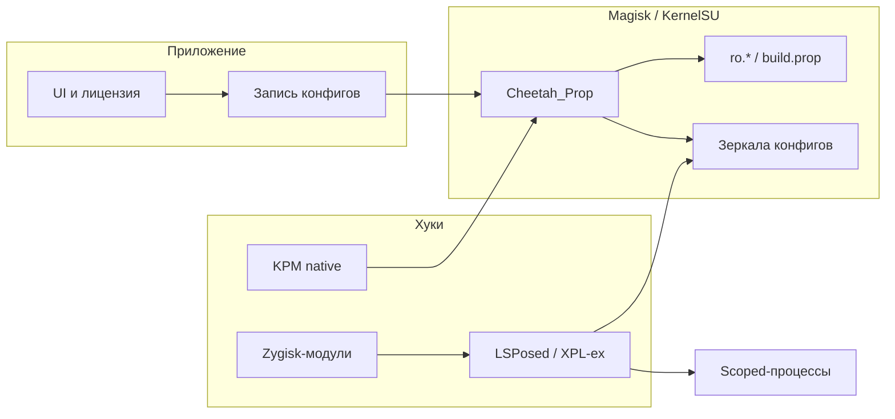

<div align="center">

# Devices Changer

**Управляемая подмена идентификаторов, сборки, сети, локации и окружения на rooted Android**

Приватность · тестирование приложений · отладка API «под другим железом»

<br>

[](app/src/main/res/values/strings.xml)
[](https://developer.android.com)
[]()
[]()

<br>

[](https://deviceschanger.org)
[](https://t.me/DeviceChanger)
[](https://t.me/DeviceChanger_bot)
[](https://github.com/Spayder666/SpoofDevice)

</div>

---

## О проекте

| | |
| --- | --- |
| **Пакет** | `com.motorola.backup` |
| **Имя в лаунчере** | Devices Changer |
| **Magisk / KernelSU модуль** | **Cheetah_Prop** → `/data/adb/modules/Cheetah_Prop` |
| **LSPosed-модуль** | Device ID Spoofer |
| **Версия** | **4.123** (code **1569**) — из `strings.xml` / `module.prop` |
| **minSdk** | 30 (Android 11) |
| **targetSdk** | 33 |
| **compileSdk** | 36 |
| **Языки UI** | English · Русский · 简体中文 |

---

## Содержание

- [Как это устроено](#как-это-устроено)
- [Требования](#требования)
- [Быстрый старт](#быстрый-старт)
- [Карта интерфейса](#карта-интерфейса)
- [Функции](#функции)
- [Help и Advanced](#help-настройки)
- [Конфиги и пути](#конфиги-и-пути)
- [LSPosed scope](#lsposed-scope--минимум)
- [Сборка](#сборка)
- [Отладка](#отладка)
- [Документы в репозитории](#документы-в-репозитории)
- [Разработка](#разработка-кратко)
- [Предупреждение](#предупреждение)

---

## Как это устроено

Один APK — менеджер. Подмена идёт **несколькими слоями**; без нужного слоя часть значений «не везде» меняется.



| Слой | Что делает |
| --- | --- |
| **Приложение** | UI, лицензия, запись конфигов, установка/обновление Cheetah_Prop, экспорт KPM, обои при первом запуске |
| **Magisk / KernelSU — Cheetah_Prop** | `post-fs-data` / `service.sh`: свойства, зеркала конфигов, `device.kernel`, автозагрузка KPM |
| **LSPosed / XPL-ex** | Java/Kotlin хуки в выбранных процессах (в т.ч. `system_server`, если **System Framework** в scope) |
| **Zygisk-модули** *(опционально)* | Hide (список приложений), MediaDrm, VPN Hide, камера StreamDC |
| **KernelPatch KPM** *(опционально, APatch / KPatch)* | native: карты/пути (`susmap`), TUN (`tunhide`), **`uname()` syscall** (`unamehide`) |

> Хуки читают актуальный конфиг из модуля и публичных зеркал (см. [Конфиги и пути](#конфиги-и-пути)).
> В `system_server` **нельзя** опираться на `/data/local/tmp/…` (`shell_data_file` → AVC deny): GPS и часть XML читаются только из каталога модуля.

---

## Требования

| | |
| --- | --- |
| Root | Magisk, KernelSU или совместимый менеджер |
| Xposed | **LSPosed** (или XPL-ex). Классический Xposed не поддерживается |
| Первый запуск | Разрешение root приложению |
| Лицензия | Активный код доступа — без него доступны только **Home** и **Help** |
| GPS / SIM / вышки | Модуль в LSPosed + scope: целевые приложения и **System Framework (`android`)** — см. [`SCOPE_REQUIREMENTS.md`](SCOPE_REQUIREMENTS.md) |

> **KernelSU:** скрытие путей модуля ломает чтение зеркал. Проект дублирует данные в модуль и публичные зеркала осознанно — см. [`KSU.md`](KSU.md).

---

## Быстрый старт

### 1. Установить APK

Release или debug. При первом запуске (если есть root) приложение само ставит/обновляет **Cheetah_Prop**. Обои из комплекта ставятся **один раз** при первом запуске (center-crop под экран).

### 2. Включить LSPosed

1. LSPosed Manager → **Modules** → включить **Device ID Spoofer**
2. **Scope:** **System Framework (`android`)** — обязательно для GPS на уровне системы и части telephony
3. Добавить приложения, которые должны видеть подмену (Maps, банки, чекеры, Settings…)
4. **Перезагрузить** устройство (или убить целевые процессы после смены scope)

Scope задаётся только в LSPosed Manager (`AutoScopeReceiver` отключён). В приложении список можно посмотреть в **Scope Manager** — только чтение.

### 3. Активировать лицензию

На **Home** — кнопка замка / поле кода. Код выдаёт [@DeviceChanger_bot](https://t.me/DeviceChanger_bot). По истечении срока остальные вкладки закрываются.

### 4. Базовый сценарий «другое устройство»

| Шаг | Действие |
| --- | --- |
| 1 | **Hooks → Device** — загрузить профили, включить Spoof, выбрать профиль → перезагрузка |
| 2 | **Hooks → FakerId** — включить нужные ID, Generate / Save |
| 3 | **Hooks → SIM / Wi‑Fi** и **Location** — оператор, вышки, сети, GPS |
| 4 | **Targets** — сузить набор хуков для отдельных пакетов, если глобальный профиль ломает приложение |
| 5 | **Help → Advanced** — Zygisk/KPM только если нужен hide / native `uname` / TUN |

> Не включайте два независимых спуфера одних и тех же свойств (чужой Magisk-модуль + Cheetah_Prop на одни и те же `ro.*`).

---

## Карта интерфейса

Нижняя карусель. Без лицензии видны только **Home** и **Help**.

| Вкладка | Зачем |
| --- | --- |
| **Home** | Среда (root, модуль, LSPosed, GPS, MediaDrm, VPN Hide…), лицензия, перезагрузка, облако |
| **Targets** | Per-app политика хуков |
| **Hide** | Скрытие списка приложений (Hide My Applist / Device Hide Zygisk) |
| **VPN Hide** | Скрытие VPN/TUN от выбранных приложений |
| **VPN/Proxy** | Встроенный туннель / прокси |
| **Hooks** | Хаб: Status, FakerId, SIM, Wi‑Fi, Device, App ID |
| **Location** | Auto Spoof GPS, координаты, вышки, спутники, датчики |
| **Camera** | StreamDC: подмена камеры (файл / RTMP) |
| **Backup** | Облачные бэкапы профилей и настроек |
| **Help** | Язык, обновления, Telegram, Advanced (модули и KPM) |

Из **Home** также открываются **System Info** и **Scope Manager**.

---

## Функции

<details>
<summary><strong>Home</strong></summary>

- Индикаторы окружения: root, Cheetah_Prop, LSPosed, GPS spoof, MediaDrm, VPN Hide / Ports, камера
- Лицензия: логин, оставшееся время, ввод кода
- Перезагрузка с подтверждением и обратным отсчётом
- Проверка обновлений (`update_check_url` → GitHub `update.json`)
- При активной лицензии — переходы в разделы и облако

</details>

<details>
<summary><strong>Hooks → Status</strong></summary>

Сводка мастер-переключателя спуфа, целевая страна (MCC/MNC для SIM/локали), USB / developer hide, карточка батареи.

**Target country** подтягивает оператора и связанные prefs под выбранную страну.

</details>

<details>
<summary><strong>Hooks → FakerId</strong></summary>

Поштучные идентификаторы. У каждой карточки — значение, тумблер и генерация.

**Типичный набор:**

- Android ID, GSF ID, Google Advertising ID, Media DRM ID
- Hardware Serial
- IMEI / MEID (SIM 1 / 2), IMSI / ICCID, SIM serial, Sub ID, номер
- Bluetooth MAC
- Locale / time zone (из страны Faker)

Кнопки пачкой: Select all, Cancel all, Random all, Clear, Save / Load list.

После **Save** конфиг пишется в модуль и зеркала. Для свойств, которые читает `system_server` или init, нужна **перезагрузка**.

</details>

<details>
<summary><strong>Hooks → SIM</strong></summary>

Телефония без «голой» карты: состояние SIM (fake present), число слотов, оператор / carrier id, CellInfo (скрытие или синтетические вышки), сигнал, roaming / тип сети, «натуральный» профиль (conservative / urban / aggressive).

Вышки работают и без реальной сети (как fallback Wi‑Fi), но **только в процессах из LSPosed scope**. Сохраните настройки — иначе чекеры читают старый XML.

</details>

<details>
<summary><strong>Hooks → Wi‑Fi</strong></summary>

Список сохранённых сетей (SSID / BSSID / extras), ручное добавление, генерация 4–7 случайных, редактирование. Скан-результаты и текущая сеть подменяются хуками `wifi_*`, если включены соответствующие тумблеры.

Опционально панель **Wigle API** для привязки сетей к местности.

</details>

<details>
<summary><strong>Hooks → Device (профили)</strong></summary>

Готовые `.prop` профили (модель, brand, manufacturer, fingerprint, id, tags, kernel, UA, vendor, набор Build.*).

1. Включить **Spoof**
2. Загрузить список — репозиторий: [SpoofDevice](https://github.com/Spayder666/SpoofDevice)
3. Выбрать профиль → перезагрузить

Как профиль превращается в `build.prop` / props модуля: [`BUILD_PROP_FROM_PROFILES.md`](BUILD_PROP_FROM_PROFILES.md).

**Ядро (Kernel release).** Java-хуки:

- `System.getProperty("os.version")`
- `getprop` / `Runtime.exec` (`uname -r` в оболочке)
- `Os.uname()` на стороне ART

Native syscall `uname()` (**номер 160 / `newuname`**) LSPosed не перехватывает. Если чекер показывает два разных release — включите **Cheetah UnameHide** в Help → Advanced → KPM auto loader (нужен APatch/KPatch). KPM читает `/data/adb/modules/Cheetah_Prop/device.kernel` (зеркало в `/data/local/tmp/device.kernel`).

</details>

<details>
<summary><strong>Hooks → App ID</strong></summary>

Per-app идентификаторы (свой Android ID и связанные значения на пакет), импорт/поиск приложений. Нужен, когда глобальный Faker ID ломает конкретный клиент.

</details>

<details>
<summary><strong>Targets (per-app хуки)</strong></summary>

Глобальный набор хуков + исключения/набор на пакет. Список id совпадает с UI (`HookPolicyIds.ALL_META`): telephony, Wi‑Fi, IDs, Build, GPS/GNSS, BLE, сенсоры, web fingerprint, USB, батарея, mount shield, airplane, satellite, FLAG_SECURE, boot-lock hide, overlay hide, WebRTC local IP и др.

Инфраструктурные координаторы (`FrameworkCentralHooks`, `PhoneProcessHook`, часть VPN Hide в `system_server`) **не** выключаются поштучно.

Политика пишется в `per_app_hooks.json` (модуль + зеркала). Хост-менеджер `com.motorola.backup` хуки на себя не вешает.

</details>

<details>
<summary><strong>Location</strong></summary>

- **Auto Spoof GPS** — город по IP, смещение порядка километров, лёгкое движение
- Ручные координаты (карта OSM / ввод)
- GeoIP-карточка, высота / точность
- Спутники и созвездия, барометр и движение
- Китайские карты (GCJ-02): хук China map SDK
- BLE: блок скана или синтетические маяки при GPS spoof
- Скрытие mock location / AppOps

Для раздачи координат всем приложениям: **System Framework** в scope + GPS включён + мастер-спуф. Координаты для `system_server` — файл в каталоге модуля, не tmp.

</details>

<details>
<summary><strong>Hide · VPN Hide · VPN/Proxy · Camera · Backup · System Info</strong></summary>

**Hide** — встроенный UI Hide My Applist: приложения, шаблоны (root / xposed / детекторы / Shizuku…), settings templates, логи. Нужен Zygisk-модуль **Device Hide Zygisk** из Help → Advanced → reboot.

**VPN Hide** — роли приложений (скрыть интерфейс/сокеты VPN). Zygisk ZIP + опционально Ports ZIP.

**VPN/Proxy** — свой туннель; при активном туннеле хук WebRTC прячет локальные ICE IP.

> `vpnhide.kpm` **не экспортируется** (Embed в boot = риск bootloop). Для native TUN — **cheetah_tunhide.kpm** только Install/Load, никогда Embed.

**Camera (StreamDC)** — подмена кадра: файл или RTMP. Zygisk-хук из Advanced.

**Backup** — облачный бэкап/восстановление (аккаунт на Home).

**System Info** — снимок «ожидание vs факт».

</details>

---

## Help (настройки)

- Язык интерфейса (пересоздание Activity)
- Telegram-канал, бот, сайт
- Проверка обновления APK

### Advanced

**Install Module** — мультивыбор (Cheetah_Prop ставится сам при старте):

| Модуль | Назначение |
| --- | --- |
| Device Hide Zygisk | Скрытие applist (вкладка Hide) |
| MediaDrm Zygisk | Native DRM id |
| VPN Hide Zygisk | Скрытие VPN |
| VPN Hide Ports | Доп. порты |
| StreamDC Camera | Подмена камеры |

**Export all KPM** → `Downloads/kpm`. Дальше вручную: KPatch → KPModule → Install/Load.

| Файл | Назначение |
| --- | --- |
| `selinux_hook_1.1.6.1.kpm` | SELinux helpers |
| `cheetah_susmap.kpm` | Скрытие карт/путей. Только Load, не Embed |
| `cheetah_tunhide.kpm` | TUN hide. Только Install/Load |
| `cheetah_unamehide.kpm` | Native `uname()` release |
| `Nohello-….kpm` | Антидетект helpers |

**KPM auto loader** — отложенная загрузка после boot (`/data/adb/service.d/cheetah_kpm_loader.sh`). Флаги: SusMap, TunHide, UnameHide + общий Enable. **Никогда Embed** в boot image из приложения.

**BRENE + SuSFS (KernelSU)** — выкладка патча в уже установленный модуль `brene`. Без BRENE кнопка бесполезна.

---

## Конфиги и пути

Главный XML — **FakerIdPrefs.xml**. Запись из приложения: модуль → tmp → public. Корень `/sdcard/FakerIdPrefs.xml` **больше не используется**.

| Назначение | Основной путь | Зеркала |
| --- | --- | --- |
| Faker prefs | `/data/adb/modules/Cheetah_Prop/FakerIdPrefs.xml` | `/storage/emulated/0/Cheetah_Prop_public/`, `/data/local/tmp/FakerIdPrefs.xml` *(не для system_server)* |
| Per-app хуки | `…/Cheetah_Prop/per_app_hooks.json` | tmp + public |
| GPS | `…/Cheetah_Prop/gps_coords.txt`, `gps_satellites.txt` | public / tmp только для приложений |
| Wi‑Fi / вышки JSON | `wifi_networks.json`, `cell_towers.json` в модуле | tmp |
| Профиль устройства | `spoof.devices.enabled`, `spoof.devices.selected.profile` | |
| Kernel release для KPM | `…/Cheetah_Prop/device.kernel` | `/data/local/tmp/device.kernel` |
| Лицензия | `/data/misc/device_license.dat` | |

Формат prefs — map Android SharedPreferences:

```xml
<map>
    <string name="androidId">1234567890abcdef</string>
    <boolean name="androidIdEnabled" value="true"/>
    <boolean name="masterSwitchEnabled" value="true"/>
    <boolean name="auto_spoof_gps_enabled" value="true"/>
</map>
```

Централизация путей: `PathManager.kt`. Не копируйте старые гайды с `/sdcard/FakerIdPrefs.xml`.

---

## LSPosed scope — минимум

| Задача | Что в scope |
| --- | --- |
| GPS «для всех» | `android` (System Framework) + клиенты карт |
| SIM / CellInfo / Settings «О телефоне» | целевые чекеры + `com.android.settings` |
| LocationManagerService, часть telephony | `android`, при необходимости `com.android.phone` |
| Web fingerprint / UA в Chrome | Chrome (и WebView-хосты) — см. [`FINGERPRINT_COM_VISITOR_ID.md`](FINGERPRINT_COM_VISITOR_ID.md) |
| FLAG_SECURE / скриншоты | `android` + `com.android.systemui` |
| Само приложение | `com.motorola.backup` (удобно для System Info) |

После смены scope **перезапустите** целевое приложение. Для `system_server` — **reboot**.

---

## Сборка

Windows, из корня репозитория:

```powershell
.\gradlew compileDebugKotlin
.\gradlew installDebug --no-configuration-cache
.\gradlew assembleRelease
```

ZIP модуля: Gradle-задачи `prepareMagiskModule`, `packageMagiskModule` — см. `app/build.gradle.kts`. Скрипты модуля: `magisk_module/` и `app/src/main/assets/`.

Release-подпись — keystore в `local.properties` (не коммитить).

---

## Отладка

```powershell
adb logcat | findstr /i "LSPosed Cheetah Hook motorola.backup"
adb shell cat /data/adb/modules/Cheetah_Prop/module.prop
adb shell cat /data/adb/modules/Cheetah_Prop/FakerIdPrefs.xml
adb shell getprop | findstr /i "fingerprint model manufacturer"
```

| Симптом | Что проверить |
| --- | --- |
| Два разных Kernel release | UnameHide KPM не загружен или нет `device.kernel` |
| Хуки «молчат» | LSPosed выкл., нет scope, тумблер в FakerId, master switch, профиль Device, GPS |
| Профили не грузятся | Сеть, URL репозитория, лог загрузчика |

---

## Документы в репозитории

| Файл | Тема |
| --- | --- |
| [`AGENTS.md`](AGENTS.md) | Цели проекта и правила разработки |
| [`GUIDE_RU.md`](GUIDE_RU.md) | Краткая инструкция по использованию (RU) |
| [`SCOPE_REQUIREMENTS.md`](SCOPE_REQUIREMENTS.md) | LSPosed scope для GPS / SIM / вышек |
| [`KSU.md`](KSU.md) | KernelSU, hide путей, зеркала |
| [`BUILD_PROP_FROM_PROFILES.md`](BUILD_PROP_FROM_PROFILES.md) | Профиль → props |
| [`PLAY_INTEGRITY_RELEVANT_PROPERTIES.md`](PLAY_INTEGRITY_RELEVANT_PROPERTIES.md) | Свойства и целостность |
| [`FINGERPRINT_COM_VISITOR_ID.md`](FINGERPRINT_COM_VISITOR_ID.md) | Web Visitor ID / Chrome |
| [`PROP_FILE_KEYS.md`](PROP_FILE_KEYS.md) | Ключи .prop |

---

## Разработка (кратко)

| | |
| --- | --- |
| Код приложения и хуков | `app/src/main/java/com/motorola/backup/` |
| Точка LSPosed | `app/src/main/assets/xposed_init` → `BootstrapHook` |
| Новый scoped-хук | константа + `HookPolicyIds.ALL_META` + строка + `HOOK_CLASSES` + `shouldApply` — см. [`AGENTS.md`](AGENTS.md) |
| UI | Jetpack Compose, Material 3, `DeviceAppShell.kt` |

> Не добавлять blacklist пакетов из-за краша хука — чинить хук.

---

## Предупреждение

Инструмент для **своего устройства**, отладки и приватности. Обход чужих защит, мошенничество и нарушение закона — на стороне пользователя. Автор не несёт ответственности за такое использование.

---

<div align="center">

**Последнее обновление README:** 2026-08-23

</div>
